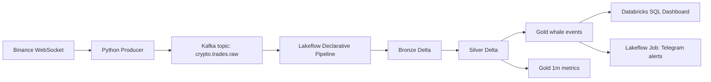

# Databricks Crypto Whale Lakehouse

Data Engineering portfolio project for detecting large BTC/USDT trades with Kafka, Databricks Lakeflow Declarative Pipelines, Delta Lake medallion tables, Databricks SQL, and Telegram alerts.

## Current Direction

This repo is now Databricks-first:

- Kafka stays as the streaming transport layer.
- Databricks Lakeflow Declarative Pipelines own Bronze/Silver/Gold ETL.
- Delta Lake is the analytical source of truth.
- Lakeflow Jobs orchestrate pipeline, alert, and validation tasks.
- Databricks SQL serves dashboards and portfolio queries.
- Local Python tests remain for deterministic development proof.

Local Docker Compose is optional fallback, not the main target.

## Architecture



## Project Docs

- `SPEC.md`: Databricks-first product specification.
- `docs/databricks/README.md`: Databricks implementation guide.
- `docs/databricks/kafka-connectivity.md`: Kafka endpoint options for Databricks.
- `docs/databricks/deployment.md`: setup and deployment checklist.
- `docs/databricks/cli-setup.md`: Windows CLI wrapper and login steps.
- `docs/architecture-overview.md`: architecture diagram and design choices.
- `docs/data-lineage.md`: field lineage from Binance to Gold/serving.
- `docs/data-quality.md`: quality gates and quarantine rules.
- `docs/analytics.md`: SQL analytics guide.
- `docs/cv-bullets.md`: resume bullets and interview talking points.
- `docs/runbooks/local-medallion-e2e.md`: local deterministic validation.

## Databricks Assets

- `databricks/pipelines/crypto_whale_pipeline.py`: Lakeflow Declarative Pipeline for Bronze/Silver/Gold Delta tables.
- `databricks/jobs/telegram_alert_task.py`: alert task reading Gold table and calling Telegram.
- `databricks/sql/warehouse_queries.sql`: Databricks SQL dashboard queries.
- `databricks.yml`: Databricks Asset Bundle scaffold.

## Local Developer Proof

Run tests and deterministic fixture validation:

```powershell
python -m unittest discover -s tests/unit
python -m src.validation.local_medallion_e2e --fixture tests\fixtures\binance_trades.ndjson --output-root data\e2e --report reports\m5\medallion-e2e.md
```

## Producer Dry Run

Run Binance payload normalization without Kafka:

```powershell
python -m src.producer.main --fixture tests\fixtures\binance_trades.ndjson --dry-run
```

For Databricks runs, configure producer to write to a Kafka endpoint reachable from Databricks, such as Confluent Cloud or Kafka/Redpanda on a cloud VM.

## Databricks CLI

Use wrapper if `databricks` is not on PATH:

```powershell
.\scripts\databricks\dbx.ps1 --version
.\scripts\databricks\dbx.ps1 auth login --host https://<your-workspace-url>
.\scripts\databricks\dbx.ps1 bundle validate
```

## Databricks Deployment Outline

1. Create or choose Kafka endpoint reachable from Databricks.
2. Configure Kafka credentials in Databricks secrets.
3. Deploy `databricks/pipelines/crypto_whale_pipeline.py` as a Lakeflow Declarative Pipeline.
4. Run pipeline to create Bronze/Silver/Gold Delta tables.
5. Run Telegram alert task through Lakeflow Job.
6. Build dashboard from `databricks/sql/warehouse_queries.sql`.

## CV Summary

- Built Kafka-to-Databricks Lakehouse pipeline for real-time crypto trade analytics.
- Implemented Bronze/Silver/Gold Delta tables with data quality gates and replayable transformations.
- Orchestrated ETL and alerting with Lakeflow Jobs and served analytics through Databricks SQL.
