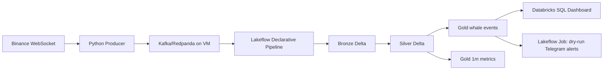

# Databricks Crypto Whale Lakehouse

End-to-end Data Engineering portfolio project for detecting large BTC/USDT trades with Kafka on a cloud VM, Databricks Lakeflow Declarative Pipelines, Delta Lake medallion tables, Databricks SQL, and dry-run Telegram alerts.

The current implementation is Databricks-first and has been validated end to end on a serverless Databricks workspace.

## Highlights

- Streams normalized Binance trade events into Kafka/Redpanda hosted on a cloud VM.
- Builds Bronze, Silver, and Gold Delta tables with Lakeflow Declarative Pipelines.
- Applies data quality expectations and deduplication before Gold serving tables.
- Runs a Lakeflow Job with pipeline orchestration plus dry-run Telegram alert task.
- Serves dashboard-ready analytics through Databricks SQL warehouse queries.
- Keeps local Python tests and fixture replay for deterministic proof.

## Architecture



## End-to-End Proof

| Story | Status | Evidence |
| --- | --- | --- |
| DBX1 | implemented | Databricks-first rewrite, unit tests, bundle validation |
| DBX2 | implemented | Serverless Lakeflow pipeline deployed with Kafka VM bootstrap; full job run `946369154796199` succeeded |
| DBX3 | implemented | Four Databricks SQL dashboard queries succeeded with Gold data |

Latest SQL evidence is stored in `reports/dbx3/sql-evidence.md`.

Validated sample Gold result:

```text
BTCUSDT BUY 2.5 BTC @ 65000 USDT = 162500 USDT
trade_id=123456789
```

## Screenshots To Add

Add images later under `docs/images/` and reference them from this README.

| Image | Suggested path | Purpose |
| --- | --- | --- |
| Architecture diagram export | `docs/images/architecture.png` | One-glance system overview for recruiters |
| Databricks pipeline successful update | `docs/images/databricks-pipeline-success.png` | Proof that Bronze/Silver/Gold Lakeflow update completed |
| Databricks job run success | `docs/images/databricks-job-success.png` | Proof that pipeline task and dry-run Telegram task succeeded |
| Gold whale events query result | `docs/images/gold-whale-events-query.png` | Shows real dashboard source data |
| SQL dashboard or query grid | `docs/images/databricks-sql-dashboard.png` | Portfolio dashboard screenshot |
| Kafka VM smoke test terminal | `docs/images/kafka-vm-smoke-test.png` | Shows producer/consumer path through VM Kafka |

## Repository Map

| Path | Purpose |
| --- | --- |
| `databricks/pipelines/crypto_whale_pipeline.py` | Lakeflow Declarative Pipeline for Bronze/Silver/Gold Delta tables |
| `databricks/jobs/telegram_alert_task.py` | Lakeflow Job task that reads Gold whale events and prints/sends alerts |
| `databricks/sql/warehouse_queries.sql` | Dashboard starter queries for Databricks SQL |
| `databricks.yml` | Databricks Asset Bundle for pipeline and job deployment |
| `src/producer/` | Binance payload normalization and Kafka producer code |
| `scripts/databricks/` | Databricks CLI wrapper and Kafka smoke-test scripts |
| `tests/` | Unit tests and deterministic Binance fixtures |
| `reports/dbx3/` | Databricks SQL evidence captured from dashboard queries |

## Kafka on VM

Databricks cannot read Kafka from a developer laptop at `localhost:9092`. Use a Kafka-compatible broker on a cloud VM and expose the broker as `<vm-ip-or-domain>:9092`.

Start Redpanda on the VM:

```powershell
$env:PUBLIC_KAFKA_HOST="<vm-ip-or-domain>"
$env:REDPANDA_IMAGE="redpandadata/redpanda:v26.1.11"
docker compose -f docker-compose.kafka.yml up -d
```

Test from your development machine:

```powershell
python scripts\databricks\kafka_smoke_test.py --bootstrap-servers <vm-ip-or-domain>:9092 --topic crypto.trades.raw
python scripts\databricks\binance_kafka_live_smoke.py --bootstrap-servers <vm-ip-or-domain>:9092 --topic crypto.trades.raw --count 3
```

Security note: open TCP `9092` only to trusted Databricks egress IPs and your development IP.

## Local Developer Proof

Run unit tests:

```powershell
python -m unittest discover -s tests/unit
```

Run deterministic local medallion validation:

```powershell
python -m src.validation.local_medallion_e2e --fixture tests\fixtures\binance_trades.ndjson --output-root data\e2e --report reports\m5\medallion-e2e.md
```

Dry-run Binance payload normalization without Kafka:

```powershell
python -m src.producer.main --fixture tests\fixtures\binance_trades.ndjson --dry-run
```

Replay fixture into Kafka VM:

```powershell
$env:KAFKA_BOOTSTRAP_SERVERS="<vm-ip-or-domain>:9092"
python -m src.producer.main --fixture tests\fixtures\binance_trades.ndjson
```

## Databricks Deployment

Use the wrapper if `databricks` is not on PATH:

```powershell
.\scripts\databricks\dbx.ps1 --version
.\scripts\databricks\dbx.ps1 auth login --host https://<your-workspace-url>
```

Validate and deploy the Asset Bundle with the VM Kafka bootstrap server:

```powershell
.\scripts\databricks\dbx.ps1 bundle validate --profile crypto-whale --var="kafka_bootstrap_servers=<vm-ip-or-domain>:9092"
.\scripts\databricks\dbx.ps1 bundle deploy --profile crypto-whale --var="kafka_bootstrap_servers=<vm-ip-or-domain>:9092"
```

Run the Lakeflow pipeline or full Lakeflow Job from Databricks UI, or with CLI commands:

```powershell
.\scripts\databricks\dbx.ps1 pipelines run crypto_whale_medallion --profile crypto-whale --var="kafka_bootstrap_servers=<vm-ip-or-domain>:9092"
.\scripts\databricks\dbx.ps1 jobs run-now 715856492035833 --profile crypto-whale
```

## Dashboard Queries

Dashboard-ready queries live in `databricks/sql/warehouse_queries.sql`:

- Largest whale trades.
- Whale volume by side per day.
- One-minute whale metrics.
- Buy/sell imbalance.

Captured query evidence lives in `reports/dbx3/sql-evidence.md`.

## Project Docs

- `SPEC.md`: Databricks-first product specification.
- `docs/databricks/README.md`: Databricks implementation guide.
- `docs/databricks/kafka-connectivity.md`: Kafka endpoint requirements for Databricks.
- `docs/databricks/kafka-smoke-test.md`: Binance/Kafka smoke test notes.
- `docs/databricks/deployment.md`: setup and deployment checklist.
- `docs/databricks/cli-setup.md`: Windows CLI wrapper and login steps.
- `docs/architecture-overview.md`: architecture diagram and design choices.
- `docs/data-lineage.md`: field lineage from Binance to Gold/serving.
- `docs/data-quality.md`: quality gates and quarantine rules.
- `docs/analytics.md`: SQL analytics guide.
- `docs/cv-bullets.md`: resume bullets and interview talking points.

## CV Summary

- Built a Kafka-to-Databricks Lakehouse for near-real-time crypto whale trade analytics.
- Hosted Kafka-compatible Redpanda on a cloud VM and streamed normalized Binance trade events.
- Implemented Bronze/Silver/Gold Delta tables with quality gates, deduplication, and replayable transformations.
- Deployed serverless Lakeflow pipeline and Lakeflow Job orchestration through Databricks Asset Bundles.
- Served portfolio analytics through Databricks SQL queries and captured query evidence from Gold tables.
