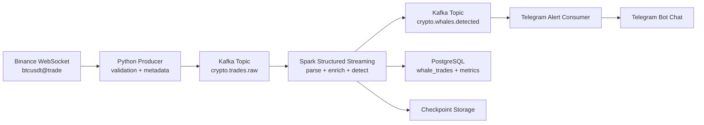

# SPEC — Real-time Crypto Whale Alert Data Pipeline

Date: 2026-06-17
Status: Draft v1
Owner: Data Engineering portfolio project

## 1. Project Summary

Xây dựng hệ thống Data Engineering xử lý giao dịch crypto thời gian thực từ Binance WebSocket, đưa dữ liệu vào Kafka, xử lý streaming bằng Spark Structured Streaming, phát hiện giao dịch lớn theo ngưỡng USD, gửi cảnh báo Telegram, và lưu lịch sử phục vụ phân tích.

Mục tiêu chính của dự án là tạo sản phẩm đủ tốt để đưa vào CV Data Engineer, chứng minh năng lực với streaming ingestion, Kafka topic design, Spark streaming transformations, data quality, observability, containerized runtime, và storage layer.

## 2. Portfolio Positioning

### CV Headline

Real-time Crypto Whale Alert Pipeline using Kafka, Spark Structured Streaming, Binance WebSocket, PostgreSQL, and Telegram Bot alerts.

### Skills Demonstrated

- Real-time data ingestion từ public WebSocket API.
- Apache Kafka producer, topic partitioning, consumer semantics, và replayable event log.
- Spark Structured Streaming đọc Kafka, parse JSON, enrich schema, windowed aggregation, và alert detection.
- Data quality checks cho event-time, numeric fields, duplicates, malformed messages.
- Storage sink cho curated whale trades và aggregated metrics.
- Operational readiness: Docker Compose, environment config, logs, metrics, retry, checkpointing.
- Documentation: architecture, data contract, runbook, validation evidence.

## 3. Problem Statement

Thị trường crypto có nhiều giao dịch lớn ảnh hưởng tâm lý thị trường. Người dùng cần hệ thống phát hiện gần thời gian thực những giao dịch BTC/USDT có giá trị lớn hơn ngưỡng định nghĩa, ví dụ `100000 USD`, rồi gửi cảnh báo và lưu lại dữ liệu để phân tích sau.

## 4. Goals

- Ingest giao dịch BTC/USDT từ Binance public WebSocket.
- Publish raw events vào Kafka topic `crypto.trades.raw`.
- Consume raw events bằng Spark Structured Streaming.
- Chuẩn hóa schema, tính `notional_usd = price * quantity`.
- Phát hiện whale trade khi `notional_usd >= WHALE_THRESHOLD_USD`.
- Gửi Telegram alert cho whale trade hợp lệ.
- Lưu whale trade và metrics vào PostgreSQL hoặc CSV fallback.
- Chạy local bằng Docker Compose với lệnh khởi động rõ ràng.
- Có test/validation cho producer parsing, Spark transform, và end-to-end happy path.

## 5. Non-goals

- Không xây trading bot hoặc đưa khuyến nghị đầu tư.
- Không đặt lệnh mua/bán.
- Không xử lý private Binance account data.
- Không đảm bảo exactly-once end-to-end với Telegram vì external alert API không transactional.
- Không xây UI phức tạp ở giai đoạn đầu.
- Không triển khai production cloud trong MVP.

## 6. Users

| User | Need |
| --- | --- |
| Portfolio reviewer | Thấy rõ năng lực Kafka/Spark/Data Engineering qua repo chạy được. |
| Data engineer learner | Dễ chạy local, dễ đọc data contract, dễ mở rộng thêm coin hoặc sink. |
| Analyst demo user | Nhận cảnh báo Telegram và xem lịch sử whale trades. |

## 7. Source Data Contract

### 7.1 Binance Stream Choice

MVP dùng Binance Spot WebSocket trade stream cho `btcusdt@trade` hoặc aggregate trade stream `btcusdt@aggTrade`.

Khuyến nghị MVP: dùng `btcusdt@trade` trước vì mỗi event tương ứng một trade khớp lệnh, phù hợp bài toán phát hiện giao dịch lớn đơn lẻ.

### 7.2 Core Fields Needed

Để tính quy mô giao dịch, cần các trường lõi sau:

| Field | Meaning | Usage |
| --- | --- | --- |
| `symbol` | Cặp giao dịch, ví dụ `BTCUSDT`. | Routing, filter, alert text. |
| `trade_id` | ID giao dịch từ Binance. | Deduplication, traceability. |
| `price` | Giá khớp lệnh. | Tính `notional_usd`. |
| `quantity` | Khối lượng crypto. | Tính `notional_usd`. |
| `trade_time` | Thời điểm giao dịch. | Event-time, latency, storage. |
| `buyer_is_market_maker` | Cờ maker/taker của bên mua. | Suy luận hướng chủ động mua/bán. |

### 7.3 Derived Fields

| Field | Formula / Rule |
| --- | --- |
| `notional_usd` | `price * quantity` vì quote asset là USDT. |
| `side_inferred` | Nếu `buyer_is_market_maker = false` thì taker là buyer → `BUY`; nếu `true` thì taker là seller → `SELL`. |
| `event_date` | Date từ `trade_time`, dùng partition/storage. |
| `ingest_time` | Thời điểm producer nhận event. |
| `processing_time` | Thời điểm Spark xử lý event. |
| `latency_ms` | `processing_time - trade_time`. |
| `is_whale` | `notional_usd >= WHALE_THRESHOLD_USD`. |

### 7.4 Raw Event Preservation

Producer phải lưu raw JSON đầy đủ vào Kafka để có thể replay khi parser hoặc business rule thay đổi.

## 8. Architecture



### 8.1 Component Responsibilities

| Component | Responsibility |
| --- | --- |
| Python Producer | Connect Binance, receive events, attach ingest metadata, publish raw JSON to Kafka. |
| Kafka | Durable buffer and replayable event log between ingestion and processing. |
| Spark Streaming Job | Parse events, enforce schema, compute notional, detect whale trades, write sinks. |
| PostgreSQL | Store curated whale trades and optional aggregated metrics. |
| Telegram Consumer | Read detected whale topic or sink output, send formatted alerts with retry/dedupe. |
| Docker Compose | Local orchestration for Kafka, Spark, PostgreSQL, and app services. |

## 9. Kafka Design

| Topic | Producer | Consumer | Purpose | Key |
| --- | --- | --- | --- | --- |
| `crypto.trades.raw` | Python Binance producer | Spark job | Raw Binance trade events. | `symbol` or `trade_id` |
| `crypto.trades.invalid` | Spark job | Optional audit process | Malformed/unparseable events. | `symbol` |
| `crypto.whales.detected` | Spark job | Telegram consumer, storage/debug consumers | Whale trade events. | `trade_id` |

Initial config:

- Partitions: `3` for raw topic, `1` for detected topic in local MVP.
- Replication factor: `1` for local Docker Compose.
- Retention: at least `24h` local; configurable.
- Message format: JSON UTF-8.

## 10. Spark Processing Design

### 10.1 Transform Steps

1. Read Kafka stream from `crypto.trades.raw`.
2. Cast `value` to string and parse JSON with explicit schema.
3. Convert `price` and `quantity` to decimal/double.
4. Convert Binance trade timestamp to event-time timestamp.
5. Compute `notional_usd`.
6. Infer active side from `buyer_is_market_maker`.
7. Mark `is_whale` using configurable threshold.
8. Write valid whale events to PostgreSQL and `crypto.whales.detected`.
9. Write invalid records to `crypto.trades.invalid` with error reason.
10. Maintain checkpoint directory for restart safety.

### 10.2 Data Quality Rules

| Rule | Invalid When | Action |
| --- | --- | --- |
| Required fields | Missing trade ID, price, quantity, symbol, or trade time. | Send to invalid topic. |
| Numeric fields | Price or quantity <= 0, non-numeric, null. | Send to invalid topic. |
| Symbol filter | Symbol not in configured allowlist. | Drop or audit based on config. |
| Duplicate trade | Same `trade_id` within watermark window. | Drop duplicate. |
| Event-time sanity | Trade time too far future or older than retention window. | Send to invalid topic or audit. |

## 11. Storage Design

### 11.1 MVP Table: `whale_trades`

| Column | Type | Notes |
| --- | --- | --- |
| `trade_id` | text primary key | Binance trade ID. |
| `symbol` | text | Example `BTCUSDT`. |
| `price` | numeric | Trade price. |
| `quantity` | numeric | Crypto amount. |
| `notional_usd` | numeric | Price * quantity. |
| `side_inferred` | text | `BUY` or `SELL`. |
| `buyer_is_market_maker` | boolean | Raw Binance flag. |
| `trade_time` | timestamptz | Event time. |
| `ingest_time` | timestamptz | Producer receive time. |
| `processing_time` | timestamptz | Spark processing time. |
| `latency_ms` | bigint | Processing latency. |
| `raw_event` | jsonb | Original Binance payload. |
| `created_at` | timestamptz | DB insert time. |

### 11.2 Optional Table: `whale_metrics_1m`

Stores one-minute aggregates by symbol and side:

- `window_start`
- `window_end`
- `symbol`
- `side_inferred`
- `trade_count`
- `total_notional_usd`
- `max_notional_usd`

## 12. Alert Design

Telegram message format:

```text
🚨 Whale Trade Detected
Symbol: BTCUSDT
Side: BUY
Quantity: 2.5000 BTC
Price: 65000.00 USDT
Notional: 162500.00 USDT
Trade Time: 2026-06-17T10:15:30Z
Trade ID: 123456789
```

Alert requirements:

- Telegram token and chat ID come from environment variables.
- Consumer deduplicates by `trade_id` before sending.
- Failed sends retry with bounded backoff.
- Alert logs must not print bot token.

## 13. Configuration

| Variable | Default | Purpose |
| --- | --- | --- |
| `BINANCE_WS_URL` | `wss://stream.binance.com:9443/ws/btcusdt@trade` | Source stream. |
| `SYMBOLS` | `BTCUSDT` | Supported symbols. |
| `KAFKA_BOOTSTRAP_SERVERS` | `localhost:9092` | Kafka broker endpoint. |
| `RAW_TRADES_TOPIC` | `crypto.trades.raw` | Raw topic. |
| `INVALID_TRADES_TOPIC` | `crypto.trades.invalid` | Invalid topic. |
| `WHALE_TRADES_TOPIC` | `crypto.whales.detected` | Whale event topic. |
| `WHALE_THRESHOLD_USD` | `100000` | Alert threshold. |
| `POSTGRES_DSN` | local compose DSN | Storage connection. |
| `TELEGRAM_BOT_TOKEN` | none | Secret. |
| `TELEGRAM_CHAT_ID` | none | Alert destination. |
| `SPARK_CHECKPOINT_DIR` | `/tmp/checkpoints/whale-alerts` | Streaming checkpoint path. |

## 14. MVP Scope

### Must Have

- Docker Compose for Kafka, Spark, PostgreSQL, and app containers.
- Python producer reading Binance WebSocket and publishing raw events.
- Spark Structured Streaming job detecting whale trades.
- PostgreSQL sink for whale trades.
- Telegram alert consumer.
- Sample `.env.example`.
- README run commands.
- Unit tests for parsing and notional calculation.
- Integration test using sample Kafka messages.

### Should Have

- Invalid event topic.
- Basic latency metrics in logs.
- Replay guide from Kafka topic.
- Configurable symbol list.

### Could Have

- Grafana/Prometheus dashboard.
- Windowed whale volume aggregates.
- Backfill/replay batch job.
- Multi-exchange adapters.
- Streamlit dashboard.

## 15. Milestones

| Milestone | Outcome |
| --- | --- |
| M1 — Skeleton | Repo structure, Docker Compose, env config, docs. |
| M2 — Ingestion | Binance producer publishes raw trade events to Kafka. |
| M3 — Processing | Spark job reads Kafka and detects whale trades. |
| M4 — Sinks | PostgreSQL storage and Telegram alert consumer work. |
| M5 — Validation | Tests, sample data, local E2E proof, README demo. |
| M6 — Portfolio polish | Architecture diagram, screenshots/log samples, CV bullets. |

## 16. Validation Plan

| Layer | Proof |
| --- | --- |
| Unit | Parser handles valid/invalid Binance payloads; notional formula tested. |
| Integration | Producer writes sample event to Kafka; Spark reads and emits whale event. |
| Streaming | Spark checkpoint restart does not re-alert duplicate trade IDs. |
| Storage | Whale trade inserted once into PostgreSQL with expected schema. |
| Alert | Telegram consumer formats message and masks token in logs. |
| E2E | One sample whale event flows raw Kafka → Spark → detected Kafka/PostgreSQL → Telegram mock. |

## 17. Architecture Decisions

### Decision 1: Kafka between Producer and Spark

Chosen because Kafka demonstrates core Data Engineering skill, buffers bursty WebSocket data, and allows replay. Simpler alternative is direct Spark WebSocket ingestion, but that weakens replayability and portfolio value.

### Decision 2: Spark Structured Streaming for Detection

Chosen because Spark is central to project goal and supports schema parsing, event-time logic, dedupe, checkpointing, and future windowed metrics. Simpler Python consumer is easier but less relevant to Data Engineer CV target.

### Decision 3: PostgreSQL over CSV as Primary Storage

Chosen because PostgreSQL better demonstrates production-like storage, idempotent inserts, SQL analysis, and schema design. CSV remains fallback for minimal local troubleshooting.

### Decision 4: Separate Telegram Consumer

Chosen to keep Spark processing separate from external side effects. This avoids tying Spark micro-batches directly to Telegram API reliability and makes retry/dedupe easier.

## 18. Open Questions

- Dùng `btcusdt@trade` hay `btcusdt@aggTrade` cho MVP cuối cùng?
- Ngưỡng mặc định `100000 USD` có đủ tạo demo thường xuyên không, hay cần chế độ demo threshold thấp hơn?
- Có cần dashboard ở MVP hay để milestone polish?
- Spark job viết PostgreSQL trực tiếp hay chỉ viết Kafka detected topic rồi consumer storage riêng?
- Có cần hỗ trợ Windows native ngoài Docker Compose không?

## 19. First Story Candidates

1. Create Docker Compose stack for Kafka, Spark, PostgreSQL.
2. Build Binance WebSocket producer and raw Kafka topic.
3. Add sample event fixtures and parser tests.
4. Build Spark Structured Streaming transform for whale detection.
5. Add PostgreSQL schema and idempotent sink.
6. Add Telegram alert consumer with mockable sender.
7. Add E2E local validation script.
8. Write README demo and CV bullet section.

## 20. Done Definition

Project MVP is done when a reviewer can clone repo, configure `.env`, run Docker Compose, start producer/Spark/consumer, inject or receive one trade event, and see a whale alert recorded in PostgreSQL plus emitted through Telegram or Telegram mock.
