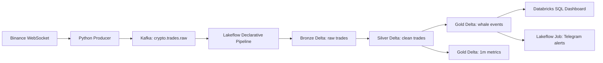

# SPEC — Databricks Lakehouse Crypto Whale Alert Pipeline

Date: 2026-06-26
Status: Databricks-first rewrite
Owner: Data Engineering portfolio project

## 1. Project Summary

Build a Data Engineering portfolio project that ingests live Binance BTC/USDT trade events into Kafka, processes them on Databricks with Lakeflow Declarative Pipelines, stores Bronze/Silver/Gold Delta tables, and serves whale alerts through Databricks SQL plus a Telegram alert job.

This project keeps Kafka as the real-time transport layer, but moves Spark, medallion storage, orchestration, validation, and dashboarding to Databricks. Local Docker remains optional fallback only.

## 2. Target Architecture

## 3. Technology Choices

| Concern | Technology | Role |
| --- | --- | --- |
| Source ingestion | Python Binance WebSocket producer | Reads public trade stream. |
| Streaming transport | Kafka | Buffers raw trade events and allows replay. |
| ETL pipeline | Databricks Lakeflow Declarative Pipelines | Builds Bronze/Silver/Gold Delta tables. |
| Storage | Delta Lake on Databricks | Medallion source of truth. |
| Orchestration | Databricks Lakeflow Jobs | Runs ETL, alert, and validation tasks. |
| Analytics | Databricks SQL | Dashboard and reviewer queries. |
| Alerting | Telegram Bot API | Sends whale alerts from Gold events. |
| Local fallback | Python tests + optional Docker Compose | Development proof only. |

## 4. Why Not Databricks Managed Ingestion Pipeline

Databricks managed ingestion is not the primary choice here because the source is Binance WebSocket routed through Kafka. The core project needs custom event normalization and Kafka semantics. Lakeflow Declarative Pipelines are a better fit because they can read Kafka and define Bronze/Silver/Gold transformations in code.

## 5. Goals

- Keep Kafka in the architecture for streaming portfolio value.
- Build Bronze/Silver/Gold Delta tables on Databricks.
- Apply data quality rules and quarantine invalid records.
- Create Gold whale events when `notional_usd >= WHALE_THRESHOLD_USD`.
- Create Gold one-minute whale metrics by symbol and side.
- Add Databricks SQL dashboard queries over Gold tables.
- Add Lakeflow Job config to run ETL and alert tasks.
- Keep local deterministic validation for development and CI-like proof.

## 6. Non-goals

- No trading bot and no investment advice.
- No Binance private account API.
- No Airflow in the first Databricks version.
- No Kubernetes.
- No requirement to keep Kafka on the same laptop as Databricks; Databricks must reach Kafka through a cloud-accessible endpoint.

## 7. Kafka Connectivity Decision

Databricks clusters cannot read `localhost:9092` on a developer laptop. For the Databricks version, Kafka must be reachable from Databricks.

Recommended options:

1. Redpanda/Kafka on a cloud VM.
2. Optional managed Kafka only if VM hosting is not available.
3. Local tunnel only for short demos, not preferred.

Local Kafka remains useful for local tests, but Databricks production-like runs require a cloud-accessible Kafka endpoint.

## 8. Data Contract

### 8.1 Raw Kafka Message

Topic: `crypto.trades.raw`
Format: JSON UTF-8
Key: `trade_id`

| Field | Type | Required | Description |
| --- | --- | --- | --- |
| `symbol` | string | yes | Trading pair, e.g. `BTCUSDT`. |
| `trade_id` | string | yes | Binance trade ID. |
| `price` | string decimal | yes | Execution price. |
| `quantity` | string decimal | yes | Base asset quantity. |
| `notional_usd` | string decimal | yes | `price * quantity`. |
| `side_inferred` | string | yes | `BUY` or `SELL`. |
| `buyer_is_market_maker` | boolean | yes | Binance maker/taker flag. |
| `trade_time` | string timestamp | yes | Event time. |
| `ingest_time` | string timestamp | yes | Producer receive time. |
| `source` | string | yes | `binance_spot_trade`. |
| `schema_version` | string | yes | Producer contract version. |
| `raw_event` | object/map | yes | Original Binance payload. |

## 9. Medallion Tables

| Layer | Table | Purpose |
| --- | --- | --- |
| Bronze | `bronze_trades` | Preserve raw normalized Kafka events. |
| Silver | `silver_trades` | Clean, typed, deduplicated trades. |
| Quarantine | `quarantine_trades` | Invalid records with error/rule context. |
| Gold | `gold_whale_events` | Whale trades above threshold. |
| Gold | `gold_whale_metrics_1m` | One-minute whale volume metrics. |

## 10. Data Quality Rules

- `trade_id` required.
- `symbol` required and in configured allowlist.
- `price > 0`.
- `quantity > 0`.
- `notional_usd > 0`.
- `side_inferred in ('BUY', 'SELL')`.
- Duplicate `trade_id` handled in Silver.
- Invalid records go to quarantine when practical.

## 11. Lakeflow Job Shape

Job: `crypto-whale-lakehouse-job`

Tasks:

1. `run_medallion_pipeline`: runs Lakeflow Declarative Pipeline.
2. `send_telegram_alerts`: reads new Gold whale events and sends Telegram messages.
3. `validation_report`: optional task that reports counts and schemas.

## 12. Dashboard Shape

Databricks SQL dashboard reads Gold tables:

- Largest whale trades.
- Whale volume by side per day.
- One-minute whale metrics.
- Buy/sell notional imbalance.
- Recent processing latency.

## 13. Local Fallback

Local code remains useful for:

- Producer normalization unit tests.
- Medallion transform tests.
- Deterministic fixture E2E report.
- Optional Docker Compose experiments.

Local Docker is no longer the main runtime target.

## 14. Milestones

| Milestone | Outcome |
| --- | --- |
| DBX1 | Databricks-first docs and project structure. |
| DBX2 | Kafka producer configurable for cloud Kafka. |
| DBX3 | Lakeflow Declarative Pipeline creates Bronze/Silver/Gold Delta tables. |
| DBX4 | Lakeflow Job runs pipeline and Telegram alert task. |
| DBX5 | Databricks SQL dashboard queries and screenshots. |
| DBX6 | Final portfolio polish and deployment guide. |

## 15. Done Definition

Project is done when a reviewer can see:

- Kafka raw event contract.
- Databricks Lakeflow pipeline source code.
- Delta medallion table design.
- Job orchestration config.
- Dashboard/SQL examples.
- Telegram alert task.
- Local tests and fixture validation evidence.
- Clear CV bullets and architecture docs.
