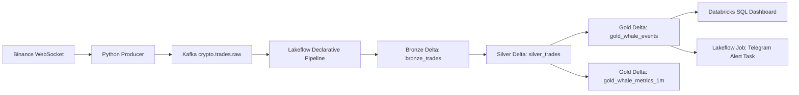

# Architecture Overview

## Databricks-First System Shape

## Design Choices

- Kafka handles live transport and replayable raw topic flow.
- Lakeflow Declarative Pipelines own medallion ETL.
- Delta Lake tables are the analytical source of truth.
- Databricks SQL is the primary serving/dashboard layer.
- Telegram alerting runs as a job task after Gold tables are available.
- Local Python tests prove business logic without requiring Databricks runtime.

## Runtime Boundary

Local Docker Compose is optional. Databricks is the main runtime target. Kafka must be cloud-accessible from Databricks.
