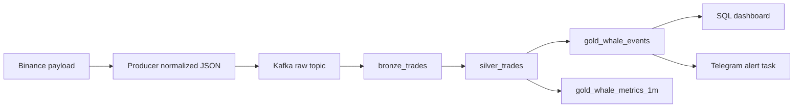

# Data Lineage

## Overview

Lineage follows a Binance trade from WebSocket payload to Kafka, Delta medallion tables, SQL dashboard, and Telegram alert task.

## Field Mapping

| Binance Field | Kafka Normalized Field | Bronze | Silver | Gold | Purpose |
| --- | --- | --- | --- | --- | --- |
| `s` | `symbol` | `symbol` | `symbol` | `symbol` | Trading pair. |
| `t` | `trade_id` | `trade_id` | `trade_id` | `trade_id` | Dedupe/idempotency. |
| `p` | `price` | `price` | `price_decimal` | `price_decimal` | Price analytics. |
| `q` | `quantity` | `quantity` | `quantity_decimal` | `quantity_decimal` | Volume analytics. |
| `p * q` | `notional_usd` | `notional_usd` | `notional_decimal` | `notional_decimal` | Whale threshold. |
| `T` | `trade_time` | `trade_time` | `trade_timestamp`, `event_date` | same | Event-time analysis. |
| `m` | `buyer_is_market_maker`, `side_inferred` | same | same | same | Buy/sell inference. |
| full payload | `raw_event` | `raw_event` | `raw_event` | `raw_event` | Debug/replay. |
| metadata | `source`, `schema_version`, `ingest_time` | same | same | same | Contract/version trace. |

## Replay Story

- Rebuild Gold from Silver when whale threshold or metric logic changes.
- Rebuild Silver from Bronze when quality rules change.
- Inspect Bronze `raw_event` when Binance schema behavior changes.
